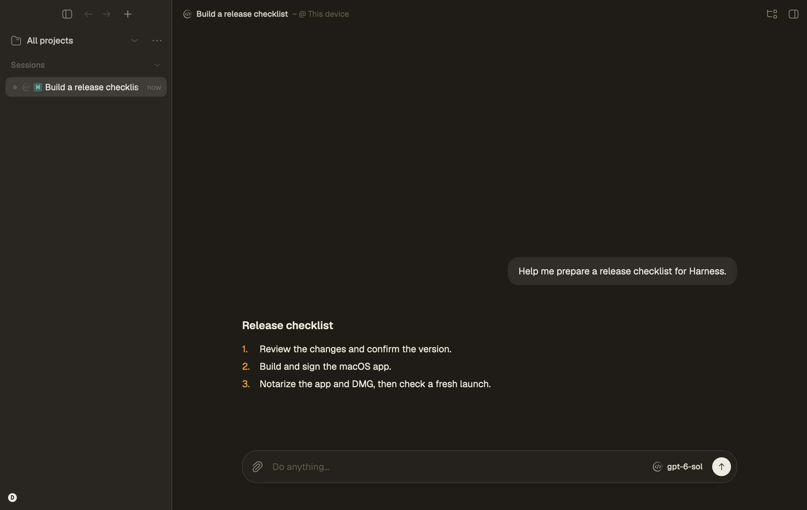

<p align="center">
  
</p>

<h1 align="center">CodeGraff</h1>

<p align="center">An AI coding agent for your terminal. One small binary, no dependencies.</p>

<p align="center">
  
  
  
  
</p>

<p align="center">
  <a href="https://trendshift.io/repositories/84216?utm_source=repository-badge&utm_medium=badge&utm_campaign=badge-repository-84216" target="_blank" rel="noopener noreferrer"></a>
</p>

<p align="center">
  <a href="#install">Install</a> ·
  <a href="#what-it-does">What it does</a> ·
  <a href="#mcp-servers">MCP</a> ·
  <a href="#desktop-app">Desktop app</a> ·
  <a href="#use-it-from-code">SDKs</a> ·
  <a href="#evaluation-results">Evaluations</a> ·
  <a href="#development">Development</a>
</p>

## Install

On macOS or Linux:

```sh
curl -fsSL https://github.com/justrach/codegraff/releases/latest/download/install.sh | sh
```

On Windows, unpack `graff-x86_64-windows.tar.gz` (or `aarch64`) from the
[latest release](https://github.com/justrach/codegraff/releases/latest) and put
`graff.exe` on your `PATH`. The [desktop app](#desktop-app) installs `graff`
for you.

```sh
graff login                      # sign in
graff                            # start an interactive session
graff -p "Explain this project"  # ask one question, answer on stdout
```

`graff update` installs the latest stable release, and `graff update --beta`
the newest beta. Both check the download against the release's `SHA256SUMS`.

<details>
<summary>Other sign-ins, installing from a checkout, and editors</summary>

```sh
graff login codex               # ChatGPT account
graff login kimi
graff login zai
graff login xai
graff key set deepseek sk-...   # any provider by API key
graff --model grok-4.6
```

From a checkout: `./install.sh` puts the binary in `~/bin`
(`HARNESS_NO_PATH=1` skips PATH edits).

`graff acp` speaks the [Agent Client Protocol](docs/embedding.md), so editors
such as Zed can run graff as an external agent. Recipe:
[docs/acp-registry.md](docs/acp-registry.md).

</details>

## What it does

Describe a task in plain English. Graff reads and edits files, runs commands,
uses browser tools, and hands parts of the work to sub-agents.

- **Build:** “Build a small app to track my workouts.”
- **Investigate:** “Find out why this page is slow.”
- **Work with data:** “Turn these CSVs into one clean spreadsheet.”
- **Compare:** “Try three approaches and test which works best.”

**Sub-agents** work in parallel, each with its own context. A `workflow` runs
phases of parallel children in sequence and passes results on through
`{{prev}}`.

**Context** stays small: stable setup is reused, large tool outputs become
handles the model pages through with `read_tool_result`, and `/compact`
shortens the transcript.

<p align="center">
  
</p>

## MCP servers

```sh
graff mcp add github                        # by name, from codegraff.com/mcp
graff mcp add https://mcp.example.com/mcp   # a remote server
graff mcp add notes -- npx -y some-mcp      # a local command
graff mcp add github --everywhere           # every project, and Harness
```

`graff mcp add` checks the server works before saving it. Browse servers by
name at [codegraff.com/mcp](https://codegraff.com/mcp). Local servers start the
first time one of their tools is used, and `"shared": true` runs one copy per
machine for every session (macOS and Linux). `/mcp` shows them in a session. Config reference:
[assets/skills/mcp-config.md](assets/skills/mcp-config.md).

## Desktop app

[Harness](https://github.com/justrach/harness) is the desktop app for graff, a
native app built with Rust and GPUI. Pick graff, or another installed coding
agent, and a model for each conversation. Review changes next to the chat,
with files, a browser, and terminals in the same window. It works locally
without an account; turn on sync to follow a session from another device.

<p align="center">
  
  <br><sub>Harness in the built-in Codegraff Dark theme. Synthetic example conversation.</sub>
</p>

- **macOS** (Apple Silicon, macOS 12+):
  [download Harness](https://github.com/justrach/harness/releases/latest/download/Harness-macos-arm64.dmg),
  drag it to Applications, and open it. It is signed and notarized, bundles
  graff, puts `graff` on your terminal `PATH`, and keeps graff up to date.
- **Windows** (x86_64):
  [portable build](https://github.com/justrach/harness/releases/latest/download/Harness-windows-x86_64.zip).
  Unpack it and run `harness.exe`.
- **Linux:** build from source, see the
  [Harness README](https://github.com/justrach/harness#get-started).

## Use it from code

```python
from harness_sdk import Harness
with Harness(yolo=True, model="gpt-5.5") as h:
    print(h.ask("what is 2+2?"))
```

```ts
import { runAgent } from "@codegraff/sdk";
for await (const ev of runAgent({ prompt: "summarize README.md", yolo: true })) {
  if (ev.type === "text") process.stdout.write(ev.text);
}
```

The SDKs in [`sdk/`](sdk/) are generated from `graff --json` and
`graff --schema`. `graff serve` runs sessions over HTTP,
[`graff mcp serve`](docs/mcp-server.md) lets other MCP clients hand graff small
tasks, and [Embedding graff](docs/embedding.md) covers `--no-local-tools` with a
sandbox MCP.

<details>
<summary><strong>CLI, slash commands, providers, permissions</strong></summary>

<br/>

```
graff [flags]                 interactive session
graff -p "prompt"             one question (answer on stdout)
graff login [codegraff|codex|kimi|xai|zai]
graff key set <provider> <key>
graff mcp add <name | url | @scope/pkg | uvx:pkg | json>
graff mcp add <name> -- <cmd>
graff learn <command>
graff --schema

--model <name>   --yolo   --json   --no-local-tools
--subagent-model <name>   --max-model-calls N
```

`-p` has no human to approve anything: pre-approve in `.harness/settings.json`
or pass `--yolo`. Full flag list: `graff --help`. Learning:
[docs/local-learning.md](docs/local-learning.md). Skills:
[docs/skills.md](docs/skills.md).

```
/model /models /clear /new /goal /loop /review /never
/plan /yolo /strict /effort /compact /rewind /btw
/skills /plugins /mcp /save /resume /sessions /help
```

A bare `/` opens a filterable menu, Esc interrupts the turn, and `/help` is the
live catalog.

| mode | what it does |
| --- | --- |
| default | ask before writes, MCP, and non-read-only bash |
| `--yolo` / `/yolo` | skip every prompt (CI, `-p`) |
| `/plan` | read-only exploration |
| `/strict` | every message is a tool |

Providers: Anthropic, OpenAI, DeepSeek, xAI, Z.AI, Kimi, Codex (ChatGPT login),
Vercel, OpenRouter, MiniMax, Xiaomi, Groq, Cerebras, Mistral, plus one
workspace router in `.graff/.config.router`. `graff models refresh` pulls the
catalogs. Claude-subscription OAuth is deliberately not supported.

</details>

## Evaluation results

The recorded live evaluation covers 12 PR tasks, with three runs per task.
A task passes when at least two runs pass. See the
[results receipt](artifacts/graff-evals-live/RECEIPT.md) for the recorded evidence.
The live, in-house, and FrontierHarness evaluations use different protocols
and should be read separately.

<details>
<summary>Recorded results and resource measurements</summary>


The recorded comparison below uses the same grok-4.6 SuperGrok seat.
Live PR tasks and distilled in-house fixtures are separate evaluations.
These are historical results, not a claim about every task or model.

<p align="center">
  
</p>

**Live 12 gated PRs** (2026-09-09, n=3, pass ≥2/3). Honest list$ is the official
low band on passing reps of passing tasks. SuperGrok cash is $0. Only graff-195
is G1–G6 certified. A check-green with no tokens does not count (exo’s last two
turbos died in &lt;1s). Receipt: [artifacts/graff-evals-live/RECEIPT.md](artifacts/graff-evals-live/RECEIPT.md).

| harness | tasks | reps | honest list$ | mean wall |
|---|---:|---:|---:|---:|
| **graff** | **12/12** | 35/36 | **$21.48** | 264s |
| Pi | 12/12 | 35/36 | $18.47 | 334s |
| OpenCode | 12/12 | 36/36 | $25.71 | 309s |
| grok | 11/12 | 33/36 | $33.69 | 362s |
| exo | **9/12** | 25/36 | $16.01 | 281s |

Grok drops `#727` (graff still 2/3). exo drops gemini-ix plus two no-token turbos.

**Distilled in-house fixtures** (`--suite inhouse`, repeatable comparison, not live):

| harness | pass | wall | calls | tokens | list$ | RSS |
|---|---:|---:|---:|---:|---:|---:|
| **graff** | **12/12** | **220s** | **53** | **234k** | **$0.32** | **8.7M** |
| grok-build | 12/12 | 490s | 60 | 1.12M | $1.07 | 155M |
| OpenCode | 12/12 | 235s | 77 | 675k | $0.68 | 1.0G |

Graff is the unique frontier on pass, wall, calls, tokens, list$, and RSS
in this measurement. (First-token is not scored — graff's `0.0s` is a boot
mark, not first model SSE. RSS is ReleaseSafe process peak.)

On the 3-task spine (exact-reply + file-ops + fix-fib) graff was **19.9s /
8 calls / $0.048** vs grok 32.3s / 8 / $0.147 and OpenCode 31.2s / 8 / $0.101.

### Footprint

| metric | measured |
| --- | --- |
| binary | **~3 MB**, zero runtime deps |
| cold start | **~1.8 ms** |
| full agentic turn | **~12 MB** peak RSS |
| 8 parallel subagents | **+0.4 MB** each |
| fat tool output | one **4 KB** handle, whatever the result's size |

Same model, same endpoint, the older Rust codegraff used **4.3×** the memory
and **~14×** the disk for a dead-heat turn. Method:
[docs/architecture.md](docs/architecture.md).

</details>

<details>
<summary>How we measure it: methodology, limitations, and reproduction</summary>

<a id="how-we-measure-it"></a>


Three evaluation layers, under `graff-evals/`. They answer different questions; none
is a leaderboard claim.

**Layer 0 — live gated PRs** (`--suite live`). Sparse-checkouts the real
package, pins the test that was red on the parent, holds out a follow-up the
public check does not name. No SPEC.md. Score pass @ n=3. ADR 0095.

**Layer 1 — the in-house runner** (`run.py`, `harnesses.json`, `tasks/`). Every
task is one JSON file: fixture files, a prompt, and a deterministic shell
`check` that decides pass/fail inside a materialized sandbox. Held-out checks
live in `hidden/` and are injected through `$TASK_ROOT` after the harness exits,
so the agent never sees them. Most harnesses take `--model`, so the same task
set can be driven through different harnesses on one model, and each run records
wall time, first-output latency, peak RSS, CPU and token usage alongside the
verdict, as JSONL plus a summary table.

45 tasks in five suites — `core` (12, sequential single-file work), `rlm` (5,
scatter-gather across files), `swe` (6, multi-file bugfixes), `mcp` (10, a
fixture MCP bench), `inhouse` (12, bug shapes distilled from shipped PRs).
`--suite all` is `core+rlm+swe`; `mcp` and `inhouse` are opt-in. 25 harness
configurations are declared, covering this project's variants plus several other
CLI agents. A task that `requires` a capability a harness lacks is skipped, not
scored as a failure. Cost is recomputed from tokens at published list rates,
because a flat-rate subscription prints `$0.0000` and that is a plan, not a
price.

What this layer proves: that a change moved a measured number on a fixed,
deterministic task set. What it does not prove: anything about the live repo —
the `inhouse` fixtures are distilled shapes, not the codebase.

**Layer 2 — `frontier-harness/`.** It runs the same 30 tasks as
[FrontierHarness Eval](https://github.com/frontier-harness-eval/eval)
— 21 from Terminal-Bench 2.1 and 9 from DeepSWE — in Docker, under a protocol
that is deliberately not the same bench seat (see "What these runs are not"
below, and `PROTOCOL.md`). The board side is a pinned snapshot of the published
results, not a live query. TB tasks are graded by running the public
`tests/test_outputs.py` inside the task container after the agent exits — pass
is `pytest` exit 0. The 9 DeepSWE tasks the upstream pack treats as having a
hidden grader are scored out of band by `grade_swe.py` against the tests
`datacurve-ai/deep-swe` actually ships, using the same images and the same
`prepare`/`test.sh` protocol, reading the verifier's `reward.json`. A missing
`reward.json` is recorded as FAIL, never inferred. A competing agent is run
locally on the same images and the same tests.

### What these runs are not

- **Not same seat as the published board.** The later recorded runs used an
  eval-only system-prompt append (`BENCH_APPEND`, passed as
  `--append-system-prompt`). It is task-shaped coaching the board's harnesses did
  not get. It never touched the shipped prompt in `prompt_text.zig`, and an
  appended-prompt result must not be placed next to a board result as a peer.
  The honest number is the un-appended first pass.
- **Different model.** The published board is Kimi K3; the recorded runs are
  mostly a different model. To compare fairly: empty `BENCH_APPEND`, same model,
  TB-21 only, and say so.
- **Different runtime.** The official eval restores a prepared VM. We
  `docker run` the public image and, on stripped images, add a CA bundle and
  install pytest so TLS and the tests can run at all. That is infrastructure,
  not a hint, but it is not bit-identical.
- **Asymmetric cost columns.** The locally run competing agent logged no token
  events, so its list price is missing — a telemetry gap, not zero. It is also
  driven through its own CLI and its own runner, so it shares the images and the
  tests but not the harness path. The chart refuses to place a row with no cost
  data on the frontier.
- **Mixed-model harness rows are a different comparison.** Entries that run
  another agent on its own native default model are not points in a same-model
  series, and `mcp` is always run in one mode because the other is a different
  tool catalog.
- Some recorded misses are environmental — an agent wall-clock cap, a server
  that did not outlive the agent process, a leftover build artifact breaking a
  file-layout constraint — and are written up as such in `FAILURES.md`. On the
  DeepSWE side `apply_failed` is not excused: it is a real failure.

### Reproduce

```sh
cd graff-evals

./run.py --harness graff                       # core+rlm+swe; mcp/inhouse are opt-in
./run.py --harness graff,grok --model grok-4.6 # harness-vs-harness, same model
./run.py --harness grok --task fix-fib --reps 3
zig build && ./run.py --harness graff-dev      # the locally built binary
./run.py --interactive                         # pick a task, watch it live
```

Results land in `results/run-<stamp>.jsonl`; `.sandboxes/` keeps the last run's
working directories for post-mortems. Both are disposable.

```sh
cd graff-evals/frontier-harness
export FH_GRAFF_MODEL=grok-4.6   # or kimi-k3 + MOONSHOT_API_KEY

python3 fh_run.py --suite tb  -j 2 --fresh --out results.jsonl      # TB-21
python3 fh_run.py --suite swe -j 2 --out swe-results.jsonl          # DeepSWE patches
python3 grade_swe.py grok-4.6                                       # grade those patches
python3 plot_tb21.py
```

The competing agent has its own runner, `fh_exo.py`, and its own binary
(`EXO_BIN`); `fh_run.py` does not drive it.

This layer is not turnkey. It needs Docker, a Linux build of the binary, the
upstream task pack, the pinned terminal-bench tests and a clone of
`datacurve-ai/deep-swe`, staged where the scripts expect them — `PROTOCOL.md`
has the locations. Model selection is an environment variable. No credential is
committed here: the metered path reads its key from the environment, and the
subscription path copies an existing local credentials file into the task
container.

</details>

## Development

| path | what it is |
|---|---|
| `src/`, `TUI/` | agent engine and terminal UI |
| `apps/` | Chrome native-messaging extension |
| `graff-evals/` | live, in-house, FrontierHarness |
| `docs/` | ADRs, architecture, images, install, embedding |
| `sdk/` | generated TypeScript / Python |
| `scripts/` | tier-1/2, PTY probes, release |

The desktop app has its own repository,
[justrach/harness](https://github.com/justrach/harness).

```bash
scripts/install-hooks.sh          # once
scripts/eval-tier1.sh             # offline checks
python3 scripts/eval-tier2.py     # model-backed, opt-in
```

Tier 1 is `zig fmt`, the 600-line ceiling, test reachability, `zig build test`
(suite count never shrinks), named goal/loop/todo invariants, and SDK drift.
Docs-only pushes skip it. In-house PR fixtures: `graff-evals/`
(`--suite inhouse`).

## License

**Modified GNU AGPL-3.0** ([`LICENSE`](LICENSE)). Network use triggers
Section 13. Authors **Rach Pradhan (justrach)** and **Yu Xi Lim (yxlyx)**
reserve the right to offer proprietary or hosted versions. A recipient's AGPL
licence is perpetual unless they breach it. Commercial permission without
copyleft exists only if **both authors grant it jointly in writing**, and is
revocable.

<p align="center"><sub>Built in Zig 0.17 dev · <a href="LICENSE">AGPL-3.0 (modified)</a> · <a href="docs/architecture.md">architecture</a> · <a href="CHANGELOG.md">CHANGELOG</a> · <a href="docs/uxlog.md">uxlog</a></sub></p>
